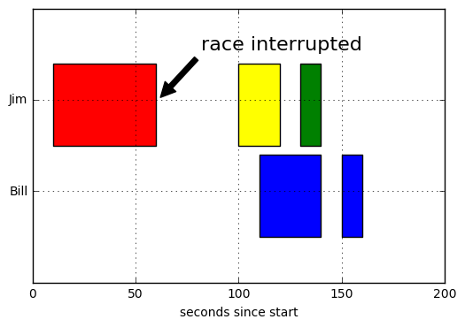

# Matplotlib Examples

It can always be intimidating to make plots in Matplotlib. So I made these examples to ease the task for you.

## Pyplot subplot subplots
plt.subplots() is a function that returns a tuple containing a figure and axes object(s). 
Thus when using fig, ax = plt.subplots() you unpack this tuple into the variables fig and ax.

    from matplotlib import pyplot as plt
    fig, ax = plt.subplots()
    plt.savefig('filename')

Equals

    fig = plt.figure()
    ax = fig.add_subplot(111)
### Fill in area between lines


```python
# Multiple Subplots
%matplotlib inline
import matplotlib.pyplot as plt
import numpy as np

x = np.arange(0.0, 2, 0.01)
y1 = np.sin(2*np.pi*x)
y2 = 1.2*np.sin(4*np.pi*x)

fig, (ax1, ax2, ax3) = plt.subplots(3, 1, sharex=True)

ax1.plot(x, y1)
ax1.set_ylabel('Y1')
ax1.axhline(y=0, xmin=0.25, xmax=0.75, color='black', lw=2, alpha=0.5)

ax2.fill(x, y2)
ax2.set_ylabel('Y2')
ax2.grid(True)

ax3.fill_between(x, y1, y2, where=y2 >= y1, facecolor='green', interpolate=True)
ax3.fill_between(x, y1, y2, where=y2 <= y1, facecolor='red', interpolate=True)
ax3.set_ylabel('btn Y1&Y2')
ax3.set_xlabel('x')

plt.show()
```


### Same X Different Ys
#### Two plots on same X-axis


```python
%matplotlib inline
import matplotlib.pyplot as plt
import numpy as np

x = np.arange(0.0, 2, 0.01)
y1 = np.sin(2*np.pi*x)
y2 = 1.2*np.sin(4*np.pi*x)

fig, ax1 = plt.subplots(figsize=(4,3))

ax1.plot(x, y1)
ax1.set_ylabel('Y1')

ax2 = ax1.twinx()
ax2.plot(x, y2, color = 'r')
ax2.set_ylabel('Y2')
# Same x different y
ax2.spines['right'].set_visible(True)

plt.show()
```


## Fine Tune Plot Example
### Bar Plot with Error Bar
Tune ticks, axis etc.


```python
%matplotlib inline
from matplotlib import pyplot as plt

x = [1,2,3,4,5,6]
y = [2,3,4,3,2,1]
y_err = [0.5,0.4,0.5,0.3,0.4,0.45]

fig , ax = plt.subplots()
ax.bar(x, y, color = '#539caf', align='center')

# remove line between error bar
ax.errorbar(x,y,y_err,color = '#297083', ls = 'none', lw = 2, capthick = 2)
ax.set_ylim([0,5])
ax.set_xlim([0,7])
#ax.set_xlabel('x')
#ax.set_ylabel('y')
ax.set_xticks(x)
ax.set_xticklabels(('G1','G2','G3','G4','G5','G6'))
ax.set_title('Bar with error bar')

# Remove the plot frame lines. They are unnecessary chartjunk.
ax.spines["top"].set_visible(False) 
ax.spines["left"].set_visible(False) 
ax.spines["right"].set_visible(False) 

# Ensure that the axis ticks only show up on the bottom and left of the plot.
ax.get_xaxis().tick_bottom()    
ax.get_yaxis().tick_left() 

# Make sure your axis ticks are large enough to be easily read. 
plt.xticks(fontsize=14)
plt.yticks(fontsize=14)
# Remove the tick marks; they are unnecessary with the tick lines we just plotted.
plt.tick_params(axis="both", which="both", bottom="off", top="off",    
                labelbottom="on", left="off", right="off", labelleft="on")

# Provide tick lines across the plot to help your viewers trace along    
# the axis ticks. Make sure that the lines are light and small so they    
# don't obscure the primary data lines.
for y in range(0, 7, 1):    
    plt.plot(range(0, 7), [y] * len(range(0, 7)), "--", lw=0.5, color="black", alpha=0.3) 
    
# Get an extra text for reading
plt.text(4.5, 4.5, 'Set a text here', fontsize=14, color=[x/255.0 for x in [255, 127, 14]])

plt.show()
```


### Stacked Bar Plot


```python
%matplotlib inline
from matplotlib import pyplot as plt

x = [1,2,3,4,5]
y1 = [1,2,3,2,1]
y1err = [0.1,0.2,0.1,0.2,0.1]
y2 = [2,1,2,3,1]
y2err = [0.1,0.2,0.1,0.2,0.1]

fig, ax = plt.subplots()
ax.bar(x, y1, yerr=y1err, align='center', color='#539caf',label='Y1')
ax.bar(x, y2, yerr=y2err, bottom=y1, align='center', color='#7663b0', label='Y2')
ax.set_xlabel('X')
ax.set_ylabel('Y')
ax.set_title('Stacked Bar Plot')
ax.legend(loc = 'upper right')
ax.set_ylim([0,6])
plt.show()
```


### Grouped Bar Plot


```python
%matplotlib inline
from matplotlib import pyplot as plt

x = [1,2,3,4,5]
x1 = [a - 0.2 for a in x]
x2 = [a + 0.2 for a in x]
y1 = [1,2,3,2,1]
y2 = [2,1,2,3,1]
ind_width = 0.4

fig, ax = plt.subplots(figsize=(4,3))
ax.bar(x1, y1, align='center', color='#539caf',label='Y1', width=ind_width)
ax.bar(x2, y2, align='center', color='#7663b0', label='Y2', width=ind_width)
ax.set_xlabel('X',fontsize=12)
ax.set_ylabel('Y',fontsize=12)
ax.set_title('Grouped Bar Plot')
ax.legend(loc = 'upper right',fontsize=10)
ax.set_ylim([0,4])
plt.show()
```


### Box Plot


```python
%matplotlib inline
from matplotlib import pyplot as plt

y = [[1.1,1.2,1.3],[1.2,1.3,1.4],[1.1,1.2,1.3]]
fig, ax = plt.subplots()
ax.boxplot(y
           # patch_artist must be True to control box fill
           , patch_artist = True
           # Properties of median line
           , medianprops = {'color': '#297083'}
           # Properties of box
           , boxprops = {'color': '#539caf', 'facecolor': '#539caf'}
           # Properties of whiskers
           , whiskerprops = {'color': '#539caf'}
           # Properties of whisker caps
           , capprops = {'color': '#539caf'})
ax.set_xticklabels([1,2,3])
ax.set_xlabel('X')
ax.set_ylabel('Y')
ax.set_title('Box Plot',fontsize=9)
ax.set_ylim([1.0, 1.5])
plt.suptitle("A Default Box Plot Try", fontsize=11)
plt.show()

```


```python
# Multiple subplots
# Set log scale
%matplotlib inline
import matplotlib.pyplot as plt
import numpy as np

x = np.arange(0,20)
y1 = np.sin(x)
y2 = np.cos(x)

fig = plt.figure()
ax1 = fig.add_subplot(211)
ax1.plot(x, y1)
ax1.set_title('Two Plots')
ax1.set_ylabel('Sin')
# "111" means "1x1 grid, first subplot" and "234" means "2x3 grid, 4th subplot".

ax2 = fig.add_subplot(212,sharex=ax1)
ax2.plot(x, y2)
ax2.set_xlabel('X')
ax2.set_ylabel('Cos')

plt.savefig('Temp.png')
```


### Pie Plot


```python
# Pie chart
%matplotlib inline
from matplotlib import pyplot as plt

fig, ax = plt.subplots(figsize=(4,4))
labels = 'Frogs', 'Hogs', 'Dogs', 'Logs'
sizes = [15, 30, 45, 10]
colors = ['yellowgreen', 'gold', 'lightskyblue', 'lightcoral']
explode = (0, 0.1, 0, 0) # only "explode" the 2nd slice (i.e. 'Hogs')

patches, texts, autotexts = ax.pie(sizes, explode=explode, labels=labels, colors=colors,
        autopct='%1.1f%%', shadow=True, startangle=90)
# Set aspect ratio to be equal so that pie is drawn as a circle.
texts[0].set_fontsize(8)
autotexts[0].set_fontsize(8)
plt.axis('equal')
plt.show()
```


### Broken Bar Plot


```python
%matplotlib inline
import matplotlib.pyplot as plt

fig, ax = plt.subplots(figsize=(6,4))
ax.broken_barh([(110, 30), (150, 10)], (10, 9), facecolors='blue')
ax.broken_barh([(10, 50), (100, 20), (130, 10)], (20, 9),
               facecolors=('red', 'yellow', 'green'))
ax.set_ylim(5, 35)
ax.set_xlim(0, 200)
ax.set_xlabel('seconds since start')
ax.set_yticks([15, 25])
ax.set_yticklabels(['Bill', 'Jim'])
ax.grid(True)
ax.annotate('race interrupted', xy=(61, 25),
            xytext=(0.8, 0.9), textcoords='axes fraction',
            arrowprops=dict(facecolor='black', shrink=0.05),
            fontsize=16,
            horizontalalignment='right', verticalalignment='top')

plt.show()
```





### Polar Plot


```python
import numpy as np
import matplotlib.pyplot as plt

fig = plt.figure()
ax = fig.add_subplot(111, polar=True)
r = np.arange(0,1,0.001)
theta = 2*2*np.pi*r
line, = ax.plot(theta, r, color='#ee8d18', lw=3)
plt.show()
```


### Events Plot


```python
%matplotlib inline
import numpy as np
from matplotlib import pyplot as plt

event1 = np.random.random([2, 100])
event2 = np.random.gamma(0.5, size=[50,100])
lineoffset = np.array([1, 5])
linelength = [1,2.5]
lineoffset2 = 1
linelength2 = 1
fig, axes = plt.subplots(nrows=2, ncols=2, figsize=(7,3), sharex=True)
axes[0][0].eventplot(event1, colors=[[1,0,0],[1,0,1]], lineoffsets=lineoffset,
            linelengths=linelength, linewidths=[1,3],
            linestyles=['solid','solid'])
axes[0][1].eventplot(event2, colors=[[0,0,0]], lineoffsets=1,
            linelengths=0.5, orientation='horizontal')
axes[0][1].set_ylim(-2,51)
axes[0][1].set_xlim([0,1])
plt.show()
```


### Histogram Plot & Scattered Plot
#### Great color resources:
    http://colorbrewer2.org/#type=sequential&scheme=YlGn&n=9
    http://tableaufriction.blogspot.ro/2012/11/finally-you-can-use-tableau-data-colors.html


```python
%matplotlib inline
import numpy as np
import matplotlib.pyplot as plt

np.random.seed(0)
mu = 100  # mean of distribution
sigma = 15  # standard deviation of distribution
x = mu + sigma * np.random.randn(437)
x1 = np.random.rand(50)
y1 = np.random.rand(50)
colors = np.random.rand(50)
area = np.pi*(15 * np.random.rand(50))**2

num_bins = 50
color = [x/255.0 for x in [237,102,93]]
fig, ax = plt.subplots(nrows=1, ncols=2, figsize=(8,3))
n, bins, patches = ax[0].hist(x, num_bins, normed=1, color=color)
ax[1].scatter(x1, y1, s=area, c=colors, alpha=0.5)
plt.show()
```


### Stacked Plot


```python
%matplotlib inline
import numpy as np
import matplotlib.pyplot as plt

def fnx():
    return np.random.randint(5, 50, 10)

y = np.row_stack((fnx(), fnx(), fnx()))
x = np.arange(10)

y1, y2, y3 = fnx(), fnx(), fnx()

fig, ax = plt.subplots(1, 2, figsize=(8,3), sharey=True)
ax[0].stackplot(x, y, colors=['#41ae76','#969696','#fc4e2a'])
ax[1].stackplot(x, y1, y2, y3, colors=['#f7fcb9','#78c679','#004529'])
plt.show()
```


